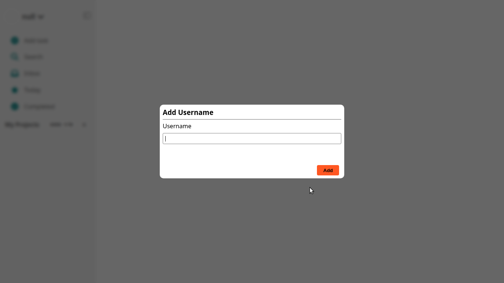
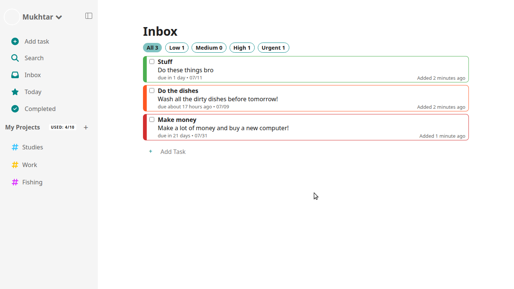
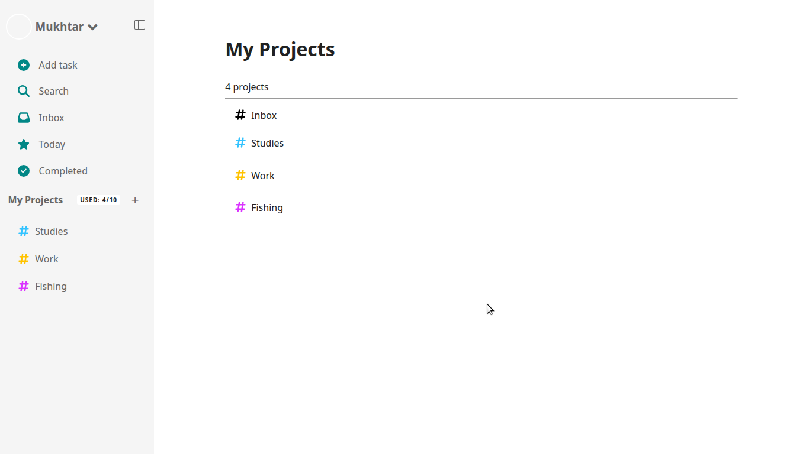
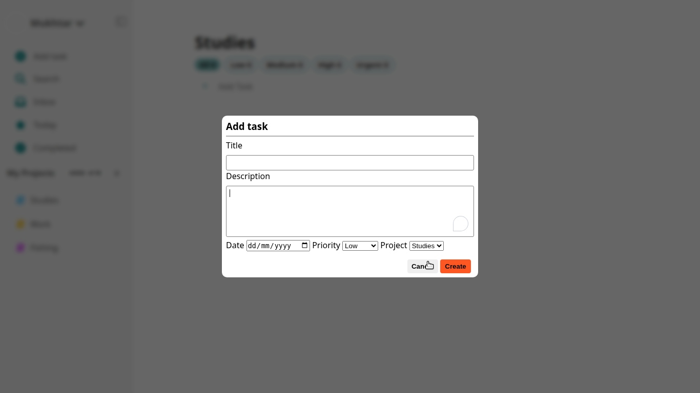
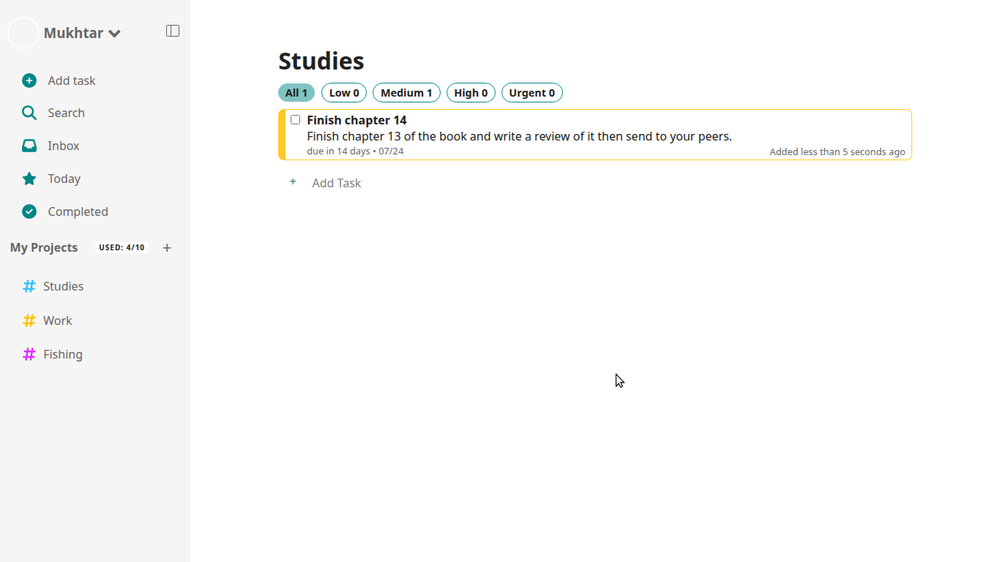
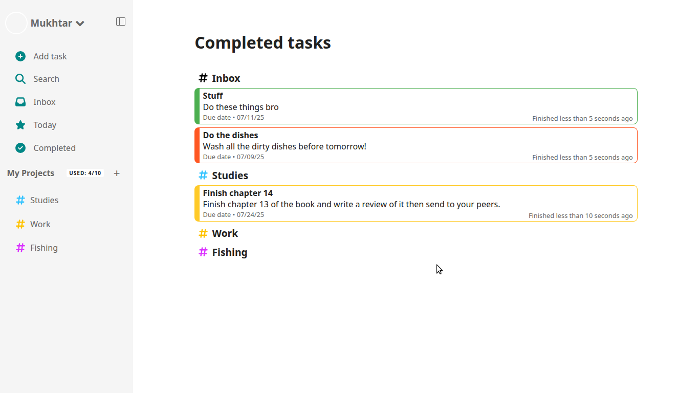

# 📝 To-Do List App

A dynamic,To-Do List web app that helps you organize tasks in their respective projects.

---

## 🚀 Features

* Intuitive UI
* ✅ Add, edit, and delete tasks
* 🎯 Mark tasks by **priority**: Low, Medium, High, Urgent
* 💾 Saves your **username** and tasks using `localStorage`
* 🔄 Built with Webpack for development and production builds
* FIlter tasks by priority
* Saves new project & tasks
* Edit task details
* Delete projects & tasks

---

## 🖥️ Tech Stack

* HTML5
* CSS3 (with CSS variables for themes)
* JavaScript (ES6+)
* Webpack
* localStorage API

---
---

## Concepts learned and practiced

* OOP: Creating projects and tasks. Using various class methods to manipulate data
* Saving and retrieving data from local storage
* Working with json data
* Dynamic User interactions: reflecting changes made by user
* Using external packages like `date-fns`

---

## 📸 Screenshots

### 🧾 Add Username Screen


### 🧾 Inbox Screen


### 🧾 Projects Screen


### 🧾 Add Task Screen


### 🧾 Project Screen


### 🧾 Completed tasks Screen


---

## 🔧 Getting Started

To run this project locally with Webpack:

1. **Clone the repo:**

   ```bash
   git clone https://github.com/muktarkabir/todo-list-app.git
   ```

2. **Navigate into the project directory:**

   ```bash
   cd todo-list-app
   ```

3. **Install dependencies:**

   ```bash
   npm install
   ```

4. **Start the development server:**

   ```bash
   npm run dev
   ```

   This will launch the app in your default browser with hot reload enabled.


---


## ✍️ Username + LocalStorage

* On first load, the app prompts for your name and stores it in `localStorage`.
* Your tasks and preferences persist across page reloads.

---

## 🌈 Customization Ideas (Future implementations)

* Sync with a backend like Firebase
* Drag-and-drop task reordering
* 🌗 Switch between **Light** and **Dark** themes
* 📱 Mobile-friendly and accessible UI
* Moving tasks across projects
* Adding toast notifications for improved user experience
  
  

---

## 📃 License

This project is licensed under the [MIT License](LICENSE).

---

## 👤 Author

**Mukhtar Kabir** – [@muktarkabir](https://github.com/muktarkabir)
